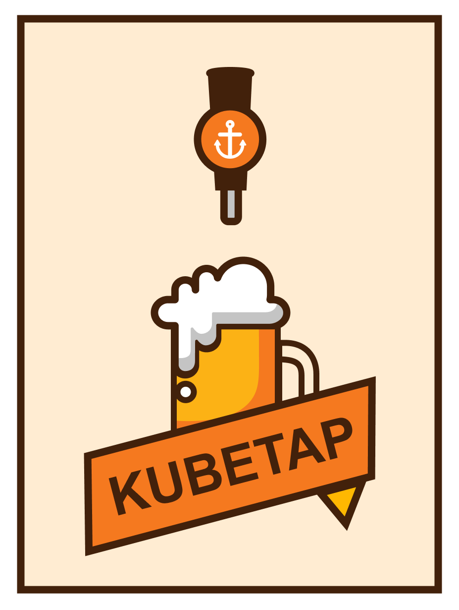

# Kubetap

<p align="center">
  
</p>

[![Build status][shield-build-status]][build-status]
[![Latest release][shield-latest-release]][latest-release]
[![Go version][shield-go-version]][go-version]
[![License][shield-license]][license]

## What is Kubetap?

Kubetap is a kubectl plugin that enables an operator to easily deploy intercepting
proxies for Kubernetes Services.

[Here is a video presentation and demo of the project][video].

## Why Kubetap?

Kubetap arose from a need to quickly and efficiently proxy Kubernetes Services
without imposing a CNI mandate.

It has always been possible to manually: add a sidecar to Deployment manifests, patch
Service manifests, add a mitmweb Service, deploy, test, code push the bugfix,
remove the sidecar from the Deployment, un-patch the Service, remove the
mitmweb Service, deploy, and test again....

Or, if you own the app, could build and push some Printf debugging...
then wait for CI... then track down the pod to get logs...

But both of those are long, laborious processes that are ripe for automation.
Thus, Kubetap was born.

## Documentation

The documentation website, [https://soluble-ai.github.io/kubetap/][kubetap-docs],
contains formatted documentation. The documentation site source is available in
the [docs folder](docs/README.md), however an abridged documentation is provided
below.

## Installation

### From Source

The recommended installation method is to clone the repository and run:

```sh
make
```

### Homebrew

Soluble provides a [homebrew formula repository](https://github.com/soluble-ai/homebrew-kubetap).

```sh
brew tap soluble-ai/homebrew-kubetap

brew install kubetap
```

### Binary Release

Binary releases for Mac (non-notarized), Windows, and Linux of varying
architectures are available from the [Releases page](https://github.com/soluble-ai/kubetap/releases).

### With Krew

Kubetap can be installed with krew:

```sh
kubectl krew install tap
```

## Usage

Kubetap's binary is `kubectl-tap`. This makes kubetap a [kubectl plugin][kubectl-plugin],
allowing it to be invoked as `kubectl tap`.

Kubetap inherits many configuration options from `kubectl`, such as: `--context`,
`--namespace` (or `-n`), `--as`, etc.

### Tap On

Deploy a MITMproxy container to tap the target Service, in the case of this example,
the `grafana` Service's exposed port `443`, which uses HTTPS. This uses the
`--browser` flag (which implies `--port-forward`) to automatically open the
proxy and target Service in a browser window.

```sh
$ kubectl tap on grafana -p443 --https --browser
Establishing port-forward tunnels to service...

Port-Forwards:

  mitmproxy - http://127.0.0.1:2244
  grafana - https://127.0.0.1:4000

```

### Tap Off

Remove the tap from the `grafana` Service.

```sh
$ kubectl tap off grafana
Untapped Service "grafana"
```

### List Active Taps

The namespaces can be constrained with `-n`, but by default it lists taps in
all namespaces:

```sh
$ kubectl tap list
Tapped Namespace/Service:

default/grafana
```

### In a container

It is possible to schedule kubetap as a Pod in Kubernetes using the
`grc.io/soluble-oss/kubectl-tap:latest` container. When run in a cluster,
kubetap will automatically detect and use serviceaccount tokens that are
mounted to the container's filesystem.

Additionally, it is possible to run the containers from a developer laptop as follows:

```sh
docker run -v "${HOME}/.kube/:/.kube/:ro" 'gcr.io/soluble-oss/kubectl-tap:latest' on -p80 myservice
```

```sh
docker run -v "${HOME}/.kube/:.kube/:ro" 'gcr.io/soluble-oss/kubectl-tap:latest' off myservice
```

## Made by Soluble.ai

This project was created to compliment the [Soluble platform][soluble].

[Building Kubetap][building-kubetap] is a blog post detailing the creation and implementation of kubetap.

[soluble]: https://www.soluble.ai/
[kubetap-docs]: https://soluble-ai.github.io/kubetap/
[shield-go-version]: https://img.shields.io/github/go-mod/go-version/soluble-ai/kubetap
[shield-build-status]: https://github.com/soluble-ai/kubetap/workflows/kubectl-tap/badge.svg?branch=master
[shield-latest-release]: https://img.shields.io/github/v/release/soluble-ai/kubetap?include_prereleases&label=release&sort=semver
[shield-license]: https://img.shields.io/github/license/soluble-ai/kubetap.svg
[license]: https://github.com/soluble-ai/kubetap/blob/master/LICENSE
[go-version]: https://github.com/soluble-ai/kubetap/blob/master/go.mod
[latest-release]: https://github.com/soluble-ai/kubetap/releases
[build-status]: https://github.com/soluble-ai/kubetap/actions
[video]: https://www.youtube.com/watch?v=hBroFtlxvkM
[building-kubetap]: https://www.soluble.ai/blog/building-kubetap
[kubectl-plugin]: https://kubernetes.io/docs/tasks/extend-kubectl/kubectl-plugins/
