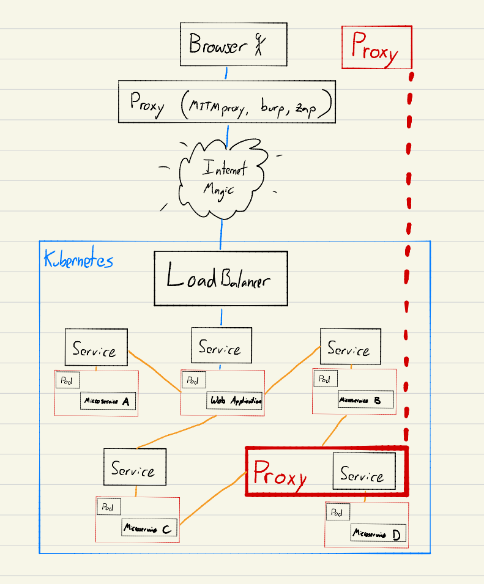
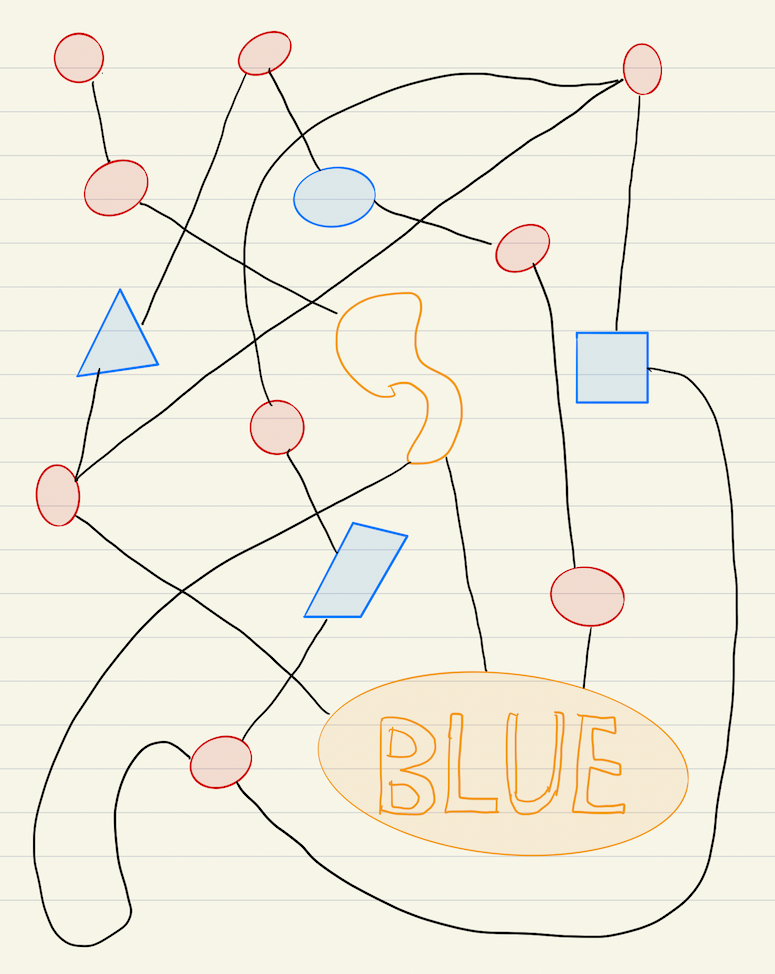

# Kubetap Documentation

  

Kubetap is a [][kubetapGH]
[open source](https://github.com/soluble-ai/kubetap) CNI-agnostic
project by [][soluble]
that automates the process of proxying Kubernetes Services.

---

  <iframe src="https://www.youtube.com/embed/hBroFtlxvkM" frameborder="0" allowfullscreen></iframe>

[VIDEO][kubetapDemo]: Kubetap introduction by
[Matt Hamilton][erinerGH]

## Use Cases

### Security Testing

When assessing web applications, it is common to use BurpSuite, MITMproxy, Zap,
or other intercepting proxy to capture and modify HTTP requests on a
security tester’s machine. These requests are intercepted and modified on the
tester’s local machine prior to being sent to the remote server.

While this paradigm allowed testers to capture and modify all traffic that the
testers themselves create, testers can not see traffic destined for the target
server that originates from other Services. The lack of visibility of intranet
traffic that does not originate from a tester’s machine can hamper a tester’s
ability to competently review complex systems and environments.

For environments that use Kubernetes, Kubetap is altering the status quo.

Kubetap allows testers to select a target Service and intercept all traffic
that is destined for that Service, regardless of where the requests originate.

The transparency and visibility afforded by Kubetap allows testers to better
understand and exercise the Service without the prohibitively (expensive) time
cost of configuring and deploying a proxy manually. **Microservices deep in a
technology stack that were once inaccessible to testers can now be proxied with ease.**

### Developer debugging

When an application or microservice is exhibiting unintended behavior,
developers must debug the application through a debugger, printf statements,
or static code analysis. This is often because infrastructure architecture looks
something like this:

What happens when the bug is only exhibited when deployed to staging and
production, and not in a local development environment?

![xkcd-979][xkcd]
[xkcd-979][xkcd]

While there are tools like [Telepresence][telepresence] that allow developers to
move containers running in a cluster on to their local machines for debugging,
this is a heavy-handed approach and not practical in many situations. Often
developers just need to visually inspect Service inputs, such as JSON objects,
that originate from other microservices.

Kubetap allows developers to deploy MITMproxy in front of a Service, enabling
visibility for all incoming HTTP traffic to that Service. With this, developers
can inspect and debug a Service without unnecessary printf debugging code-pushes

[View the Quick start guide to begin using kubetap](getting_started/quick-start.md)

[kubetapGH]: https://github.com/soluble-ai/kubetap
[soluble]: https://www.soluble.ai
[kubetapDemo]: https://www.youtube.com/watch?v=hBroFtlxvkM
[erinerGH]: https://github.com/eriner
[telepresence]: https://github.com/telepresenceio/telepresence
[xkcd]: https://imgs.xkcd.com/comics/wisdom_of_the_ancients.png
