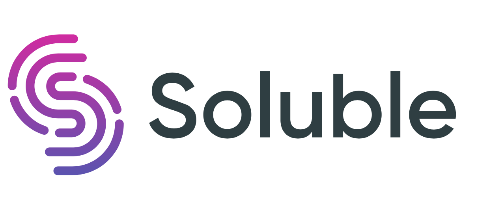

# About

Kubetap was built by Matt Hamilton, aka [Eriner](https://github.com/eriner), at [Soluble.ai](https://www.soluble.ai/).

  

## Kubetap

There is a [blog post on the Soluble website][building-kubetap] that details the
development motivation and implementation of Kubetap.

## Soluble

Soluble makes Kubernetes security simple, providing strong identity, access,
certificates, policy, secrets, and more. Using a pay-for-what-you-use pricing
model, Soluble offers services built on accepted third party and open source
tools, managed by its SaaS-based API control plane. Founded in 2019 by industry
veterans with experience running security and operations at large organizations,
Soluble is backed by Dell Technologies Capital.

You can [click here to learn more about Soluble and how we're operationalizing Kubernetes security](https://www.soluble.ai/).

[building-kubetap]: https://www.soluble.ai/blog/building-kubetap
